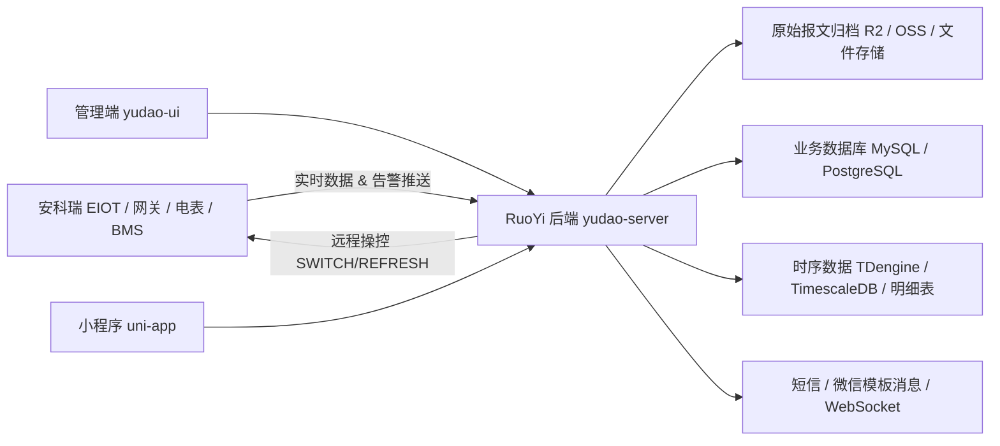

# 整体架构设计

## 系统定位

移动储能系统面向移动储能设备、储能车、移动充电服务、应急供电、削峰填谷等场景，核心能力包括：

- 设备台账管理
- 实时状态监控
- 电池运行数据展示
- 告警处理
- 充放电任务管理
- 客户和项目管理
- 计费结算
- 小程序移动运维
- 安科瑞 EIOT 数据接入

## 总体架构

## 技术选型

| 层级 | 推荐方案 | 说明 |
| --- | --- | --- |
| 后端框架 | RuoYi-Vue-Pro / Spring Boot | 复用权限、租户、菜单、字典、日志、代码生成 |
| 管理端 | yudao-ui / Vue3 | 新增移动储能业务页面 |
| 小程序 | uni-app | 当前项目已有基础，可继续沿用 |
| 业务数据库 | MySQL 或 PostgreSQL | 与 RuoYi 主库保持一致优先 |
| 时序数据 | TDengine / TimescaleDB / 独立明细表 | 高频采集数据建议独立存储 |
| 缓存 | Redis | 在线状态、最新数据、令牌、热点统计 |
| 数据接入 | 独立 worker 或后端 webhook | 推荐保留 worker 做缓冲和原始报文归档 |
| 文件存储 | MinIO / OSS / R2 | 原始推送、报表、附件归档 |

## 系统边界

### RuoYi 后端负责

- 业务主数据
- 权限、角色、菜单
- 管理端接口
- 小程序接口
- 计费、调度、告警闭环
- 统计报表

### EIOT worker 负责

- 接收安科瑞推送
- 鉴权和限流
- 原始报文归档
- 数据清洗
- 异常重试
- 将最新状态和历史数据同步到后端或数据库
- 接收后端下发的控制指令，转发到 EIOT 平台（如 worker 保留）

### RuoYi 后端负责（EIOT 控制）

- 管理 EIOT 平台凭证和 Token 刷新
- 封装远程操控接口（SWITCH / REFRESH / FORCESWITCH）
- 记录全量操控日志
- 充放电会话与 SWITCH 指令联动

### 小程序负责

- 移动端查看设备状态
- 运维确认告警
- 查看计费和充放电记录
- 发起简单调度或服务请求

## 部署建议

### 开发期

- RuoYi 后端和管理端本地启动
- 小程序本地使用微信开发者工具
- EIOT worker 使用模拟推送数据
- 数据库先使用单库，降低调试成本

### 生产期

- 后端、管理端、小程序接口统一走 HTTPS
- EIOT 接入口和业务接口分域名
- 高频数据进入时序库或独立分区表
- 原始报文进入对象存储
- 告警和调度操作写审计日志

