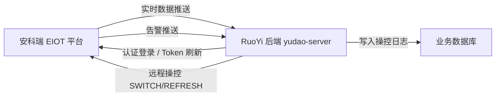
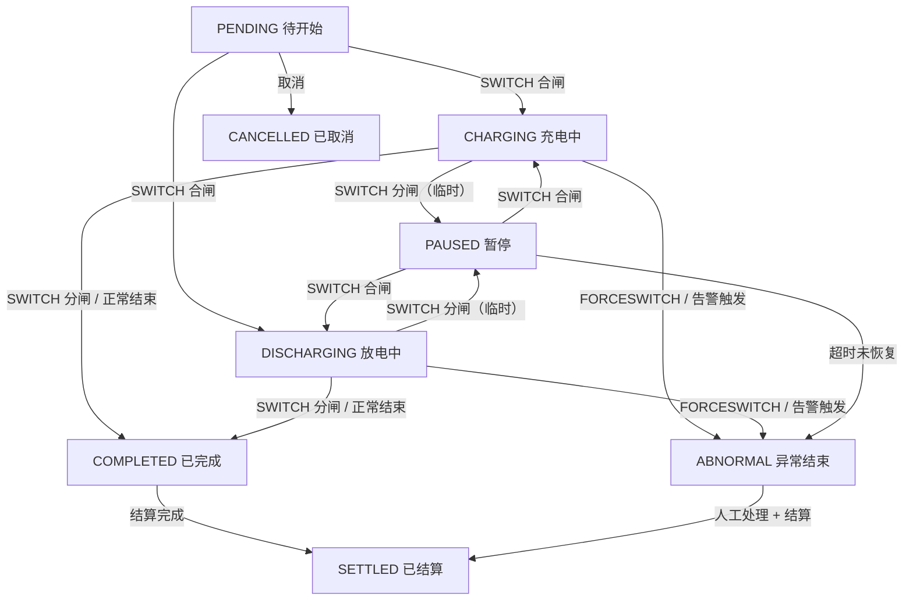

# EIOT 双向控制与充放电会话闭环设计

## 背景

当前设计已覆盖 EIOT → 本系统的单向数据流（实时数据推送、告警推送）。根据《安科瑞 EIOT 数据对接标准》第 3 章，EIOT 平台同时提供**数据访问**能力，包括 Token 认证和远程操控接口。充放电会话的完整闭环需要本系统**主动向 EIOT 下发控制指令**（合闸开始充电、分闸结束充电），而非仅被动接收数据。

## 双向数据流



## EIOT 认证

### 登录接口

EIOT 通过 HTTP 接口提供 Token 认证，所有远程操控必须先获取 Token。

```text
POST http://{EIOT_IP}:{EIOT_PORT}/basic/prepayment/auth_user/login
Content-Type: application/x-www-form-urlencoded
```

请求参数：

| 字段 | 类型 | 说明 |
| --- | --- | --- |
| params | string | AES-128-CBC 加密的 JSON 字符串，原文格式 `{"LoginName":"admin","PassWord":"12345678"}` |

加密规范：

| 参数 | 值 |
| --- | --- |
| 算法 | AES/CBC/NoPadding（Zero Padding） |
| 密钥长度 | 128 bit |
| 密钥（Key） | `1234567890123456` |
| 偏移量（IV） | `1234567890123456` |
| 编码 | Base64 |
| 字符集 | UTF-8 |

加密流程：

1. 构造 JSON 明文 → `{"LoginName":"admin","PassWord":"12345678"}`
2. 转为 UTF-8 字节数组
3. 按 16 字节块大小补零（Zero Padding）
4. AES-128-CBC 加密
5. Base64 编码
6. 作为 `params` 表单字段发送

响应：

```json
{
  "success": "1",
  "errorCode": "",
  "errorMsg": "",
  "data": {
    "token": "userweb_eyJ0eXBlIjoiSldUIiwiYWxnIjoiSFMyNTYifQ.eyJpZCI6MSwi..."
  }
}
```

| 字段 | 类型 | 说明 |
| --- | --- | --- |
| success | string | `"1"` 成功，`"0"` 失败 |
| errorCode | string | 错误码，成功时为空 |
| errorMsg | string | 错误信息 |
| data.token | string | JWT Token，后续控制请求携带 |

### Token 管理

```text
energy_eiot_credential
```

每个租户可维护一组 EIOT 凭证：

| 字段 | 类型 | 说明 |
| --- | --- | --- |
| id | bigint | 主键 |
| platform_name | varchar(64) | EIOT 平台名称 |
| base_url | varchar(256) | EIOT 基础地址，如 `http://192.168.1.100:8080` |
| login_name | varchar(64) | 登录账号 |
| login_password | varchar(128) | 登录密码（明文存储，用于 AES 加密构造 params） |
| current_token | varchar(2048) | 当前有效 Token |
| token_expire_time | datetime | Token 过期时间 |
| status | tinyint | 状态：0 启用，1 禁用 |
| tenant_id | bigint | 租户编号 |

Token 刷新策略：

- 后端启动时不自动登录，首次控制请求前懒加载登录。
- 控制请求返回 `errorCode = "10004"/"10005"/"10006"`（Token 相关错误码）时触发重新登录并重试。
- 定时任务提前 5 分钟刷新即将过期的 Token。
- Token 获取失败记录操作日志，不影响其他业务。

## 远程操控

### 控制接口

```text
POST http://{EIOT_IP}:{EIOT_PORT}/basic/prepayment/entry/home/control
Content-Type: application/json
token: {EIOT_TOKEN}
```

请求体：

```json
{
  "gatewaySn": "SYZ21110520007",
  "meterSn": "1",
  "method": "SWITCH",
  "value": {
    "Switch": "1"
  }
}
```

| 字段 | 类型 | 必填 | 说明 |
| --- | --- | --- | --- |
| gatewaySn | string | 是 | 网关序列号 |
| meterSn | string | 是 | 电表序列号（对应本系统 `energy_device.meter_sn`） |
| method | string | 是 | 控制方法，见下方方法表 |
| value | object | 是 | 方法参数，结构因 method 而异 |

响应：

```json
{
  "success": "1",
  "errorCode": "",
  "errorMsg": "",
  "data": null
}
```

统一响应格式与本系统入站接口一致：`success = "1"` 表示 EIOT 接收指令成功。

### 控制方法

第一版充放电场景需要的方法：

| method | 用途 | value 结构 | 充放电场景 |
| --- | --- | --- | --- |
| `SWITCH` | 分合闸 | `{"Switch": "1"}` 合闸 / `{"Switch": "0"}` 分闸 | 开始充电（合闸）、结束充电（分闸） |
| `FORCESWITCH` | 强制分合闸 | `{"ForceSwitch": "1"}` / `{"ForceSwitch": "0"}` | 紧急断电、安全停机 |
| `REFRESH` | 召测 | `{}` | 主动拉取最新数据（会话开始前/结束后确认读数） |
| `STRONGSWITCH` | 强控开关 | `{"ControlMode":[true,true,true],"Line":[true,true,true]}` | 多回路控制、削峰填谷场景 |
| `RESET` | 复位 | `{"Reset": "1"}` | 故障后恢复 |
| `SELCHK` | 自检 | `{"SelChk": "1"}` | 定期维护自检 |
| `RLYREP` | 继电器复位 | `{"RlyRep": "1"}` / `{"RlyRep": "0"}` | 继电器故障恢复 |

### 操控流程

```text
1. 用户发起控制请求（管理端/小程序）
2. 后端校验权限和设备状态
3. 后端从 energy_eiot_credential 获取或刷新 Token
4. 后端构造请求体，调用 EIOT 控制接口
5. 写入 energy_device_control_log（无论成功失败）
6. 返回结果给用户
```

## 充放电会话状态机

### 状态定义

```text
PENDING     待开始（调度任务已创建，等待执行）
CHARGING    充电中（合闸 + run_mode=充电）
DISCHARGING 放电中（合闸 + run_mode=放电）
PAUSED      暂停（临时分闸，可能恢复）
COMPLETED   已完成（正常分闸结束）
ABNORMAL    异常结束（告警触发、强制分闸）
SETTLED     已结算（费用计算完成）
CANCELLED   已取消（调度任务取消）
```

### 状态流转



### 会话与 EIOT 控制的关联

| 会话操作 | EIOT 指令 | 数据采集 |
| --- | --- | --- |
| 创建会话 | — | — |
| 开始充放电 | `SWITCH {"Switch":"1"}` | 写入 `start_energy`（从当前 EPI/EPE 快照） |
| 主动召测 | `REFRESH` | 对比召测返回的 EPI/EPE |
| 正常结束 | `SWITCH {"Switch":"0"}` | 写入 `end_energy`、计算 `total_energy` |
| 紧急停止 | `FORCESWITCH {"ForceSwitch":"0"}` | 状态标记 ABNORMAL |
| 暂停 | `SWITCH {"Switch":"0"}` | 状态标记 PAUSED |
| 恢复 | `SWITCH {"Switch":"1"}` | 恢复为 CHARGING/DISCHARGING |

### 自动 vs 手动结束

第一版采用**手动控制为主 + 数据监控为辅**：

- **手动**：用户在管理端/小程序点击"开始充电"/"结束充电"，后端下发 SWITCH 指令。
- **自动检测**：实时数据推送中 `SwitchSta` 变化或 `run_mode` 变化时，自动更新会话状态。
- **安全保护**：告警（电池温度过高、过流等）触发时，可配置是否自动 FORCESWITCH 并结束会话。

### 电量计算

```
充电量 (total_energy) = end_epi - start_epi
放电量 (total_energy) = end_epe - start_epe

电量费用 (energy_fee) = total_energy × energy_rate
时间费用 (time_fee)   = duration_hours × time_rate
总费用   (total_fee)   = energy_fee + time_fee
```

`start_epi`/`start_epe` 在会话开始时从 `energy_telemetry` 最新记录快照，`end_epi`/`end_epe` 在会话结束时从最新记录快照。

## 新增数据库表

### energy_eiot_credential EIOT 平台凭证表

| 字段 | 类型 | 说明 |
| --- | --- | --- |
| id | bigint | 主键 |
| platform_name | varchar(64) | EIOT 平台名称 |
| base_url | varchar(256) | EIOT 基础地址 |
| login_name | varchar(64) | 登录账号 |
| login_password | varchar(128) | 登录密码 |
| current_token | varchar(2048) | 当前有效 Token |
| token_expire_time | datetime | Token 过期时间 |
| status | tinyint | 状态：0 启用，1 禁用 |
| tenant_id | bigint | 租户编号 |
| creator/create_time/updater/update_time/deleted | RuoYi 标准字段 | 审计字段 |

### energy_device_control_log 设备操控日志表

| 字段 | 类型 | 说明 |
| --- | --- | --- |
| id | bigint | 主键 |
| device_id | bigint | 设备编号 |
| session_id | bigint | 关联会话编号（可为空，独立操控也记录） |
| credential_id | bigint | 使用的 EIOT 凭证编号 |
| method | varchar(32) | 控制方法：SWITCH/FORCESWITCH/REFRESH 等 |
| request_body | varchar(2048) | 发给 EIOT 的请求体 |
| response_body | varchar(2048) | EIOT 返回的响应体 |
| eiout_success | tinyint | EIOT 返回 success：0 失败，1 成功 |
| eiout_error_code | varchar(32) | EIOT 返回 errorCode |
| status | tinyint | 状态：0 成功，1 失败 |
| error_msg | varchar(1024) | 失败原因 |
| operator_id | bigint | 操作人 |
| operate_time | datetime | 操作时间 |
| tenant_id | bigint | 租户编号 |
| creator/create_time | RuoYi 标准字段 | 审计字段 |

## 新增接口

### 管理端设备远程操控

```text
POST /admin-api/energy/device/control
```

权限标识：`energy:device:control`

请求体：

```json
{
  "deviceId": 1900001,
  "method": "SWITCH",
  "value": {
    "Switch": "1"
  },
  "sessionId": null
}
```

| 字段 | 类型 | 必填 | 说明 |
| --- | --- | --- | --- |
| deviceId | long | 是 | 设备编号 |
| method | string | 是 | 控制方法 |
| value | object | 是 | 方法参数 |
| sessionId | long | 否 | 关联会话编号，充放电场景传入 |

响应 `data`：

```json
{
  "controlLogId": 1,
  "success": true,
  "eioutErrorCode": "",
  "message": "合闸指令下发成功"
}
```

### 管理端操控日志查询

```text
GET /admin-api/energy/device/control-log/page
```

权限标识：`energy:device:control-log:query`

查询参数：

| 字段 | 类型 | 必填 | 说明 |
| --- | --- | --- | --- |
| pageNo | integer | 是 | 页码 |
| pageSize | integer | 是 | 每页条数 |
| deviceId | long | 否 | 设备编号 |
| method | string | 否 | 控制方法 |
| status | integer | 否 | 状态 |
| operateTime | array | 否 | 操作时间范围 |

### 小程序设备操控（第一版）

```text
POST /app-api/energy/device/control
```

请求体同管理端。小程序端默认不允许 FORCESWITCH（仅管理端可执行强制操作）。小程序仅允许操作已授权设备。

权限过滤：

- 按 `energy_user_scope` 验证当前 App 用户是否有该设备的操作权限。
- 第一版小程序只开放 SWITCH（正常启停），FORCESWITCH 和 RESET 仅管理端可用。

### 充放电会话启停（便捷接口）

```text
POST /admin-api/energy/charge-session/start
POST /admin-api/energy/charge-session/stop
POST /admin-api/energy/charge-session/pause
POST /admin-api/energy/charge-session/resume
POST /admin-api/energy/charge-session/settle
```

这些是充放电会话的业务便捷接口，内部封装了 EIOT SWITCH 指令和电能快照逻辑：

`start` 请求体：

```json
{
  "deviceId": 1900001,
  "sessionType": 0,
  "pricingRuleId": 1900301
}
```

| 字段 | 类型 | 必填 | 说明 |
| --- | --- | --- | --- |
| deviceId | long | 是 | 设备编号 |
| sessionType | integer | 是 | 0 充电，1 放电 |
| pricingRuleId | long | 否 | 计费规则，不传则按客户/项目默认规则 |

`start` 响应 `data`：

```json
{
  "sessionId": 1900501,
  "sessionNo": "SES202606010001",
  "status": "CHARGING",
  "startTime": "2026-06-01 14:30:00",
  "startEpi": 12345.6,
  "controlResult": {
    "success": true,
    "message": "合闸指令下发成功"
  }
}
```

`stop` 请求体：

```json
{
  "sessionId": 1900501,
  "endEpi": 12350.2
}
```

`endEpi`/`endEpe` 可选，不传则后端从最新采集记录自动取值。

`stop` 响应 `data`：

```json
{
  "sessionId": 1900501,
  "status": "COMPLETED",
  "endTime": "2026-06-01 16:30:00",
  "totalEnergy": 4.6,
  "durationMinutes": 120,
  "energyFee": 4.14,
  "timeFee": 0.00,
  "totalFee": 4.14,
  "controlResult": {
    "success": true,
    "message": "分闸指令下发成功"
  }
}
```

`settle` 请求体：

```json
{
  "sessionId": 1900501
}
```

处理规则：

- 只有 COMPLETED 或 ABNORMAL 状态的会话可以结算。
- 结算后状态变为 SETTLED，不可再修改。
- 结算写入操作日志。

## EIOT 错误码处理

调用 EIOT 控制接口或登录接口时，常见错误码和处理策略：

| errorCode | 含义 | 处理策略 |
| --- | --- | --- |
| 10004 | Token 无效 | 重新登录获取 Token，重试一次 |
| 10005 | Token 过期 | 重新登录获取 Token，重试一次 |
| 10006 | Token 缺失 | 检查请求头，重新发送 |
| 2102 | 参数校验失败 | 检查 gatewaySn/meterSn，返回明确错误 |
| 2022 | SN 不存在 | 检查设备绑定关系 |
| 2100 | 通用错误 | 记录日志，返回 EIOT 原始 errorMsg |
| 4151 | Redis 异常 | EIOT 平台内部异常，稍后重试 |

重试策略：

- Token 相关错误（10004/10005/10006）：自动刷新 Token → 重试一次。
- 平台内部错误（4151/4152/4153）：指数退避重试，最多 3 次。
- 业务错误（2102/2022）：不重试，直接返回错误给用户。

## 安全约束

- 所有控制请求必须记录 `energy_device_control_log`，不可删除。
- FORCESWITCH 和 RESET 仅管理端可用，小程序不允许。
- 同一设备同一时间只能有一个进行中的会话（CHARGING/DISCHARGING/PAUSED）。
- 设备离线时允许下发指令（EIOT 会在设备上线后转发），但需提示用户。
- 操控接口必须登录校验，写入操作日志。
